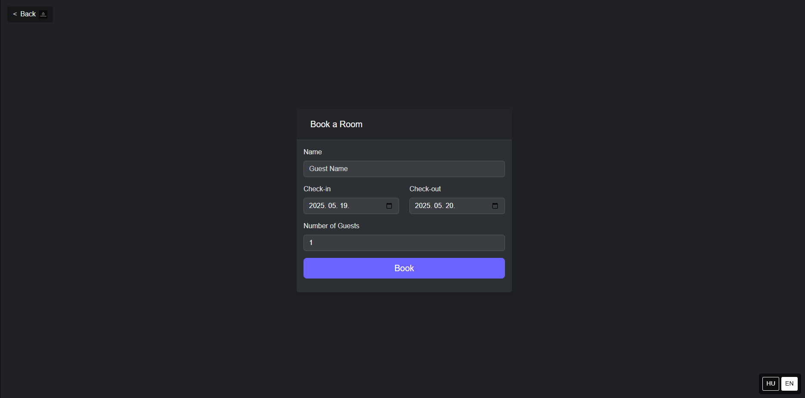
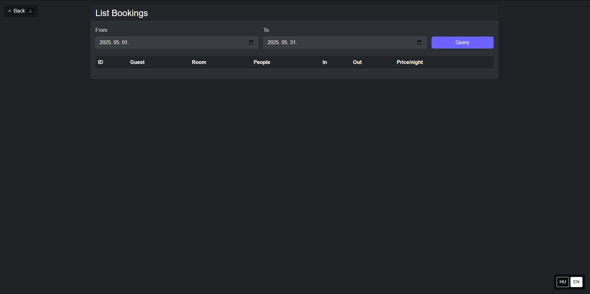
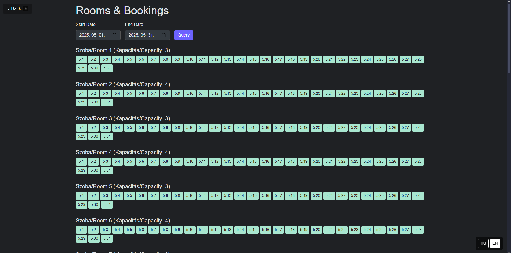

# HotelManagerApp

A simple, responsive hotel room management web app built with F# and Giraffe.
Live Link: https://hotelmanager-ffd8h9hvb9gkcygu.germanywestcentral-01.azurewebsites.net/index.html
## Key Features

- **Book Room**  
  Enter guest name, check-in/check-out dates and number of guests; automatic room assignment and reservation.

- **List Bookings**  
  Filter by date range; view booking ID, guest name, room number, guest count, check-in, check-out, and nightly fees.

- **Rooms & Bookings**  
  Visual calendar: colored “pill” indicators for each day showing free (green) or booked (red) status.

- **Cancel Booking**  
  Remove a reservation by GUID; confirmation or error message.

- **Payment Processing**  
  Select a booking, calculate total based on rate × nights × guests, and mark as paid.


- **Multilingual UI**  
  English and Hungarian interface selectable via bottom-corner toggles.

## Architecture & Technologies

- **F# + Giraffe** on ASP.NET Core  
- **MailboxProcessor** for in-memory state  
- **Bootstrap 5** with dark theme  
- **StaticFiles** under `wwwroot` for HTML, CSS, JS  
- **GitHub Actions → Azure App Service** CI/CD

## Prerequisites

- .NET 8.0 SDK  
- Git  
- (Optional) Azure CLI + App Service subscription

## SOON
- **Revenue Statistics**  
  Aggregate paid bookings by room for the current month; display totals and chart.

## Photos
**Main Site**

**Boooking Site**

**List of Bookings**

**Free & Booked Rooms**



  
## Installation & Running Locally

```bash
git clone https://github.com/your-org/HotelManagerApp.git
cd HotelManagerApp

# restore and build
dotnet restore
dotnet build

# run the app
dotnet run


